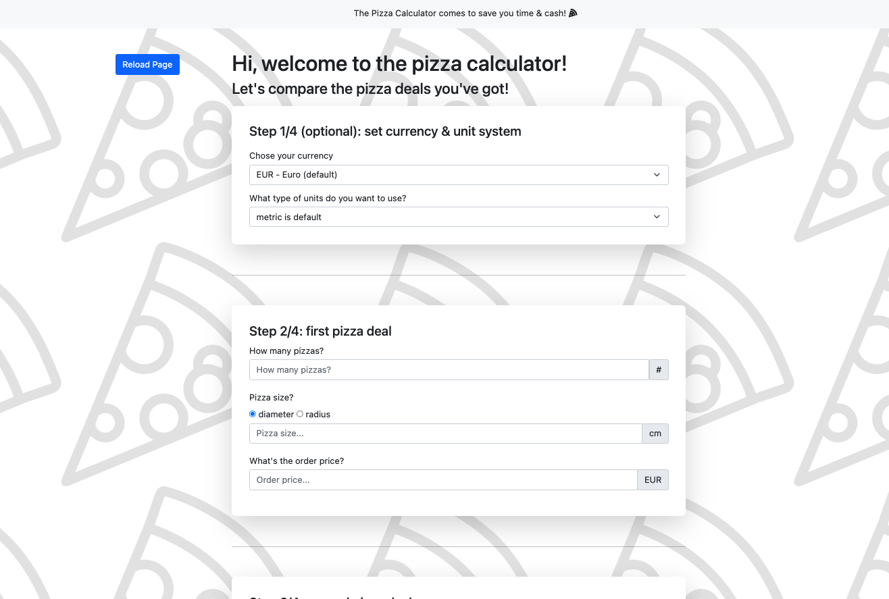

# project11-pizza-calculator
Javascript web app comparing two pizza deals and using public API to check cost in different currencies

## Concept

Ever wondered which pizza place to order your pizza from? Which deal is better? Two 12'' pizzas for $25 or one large 25'' for 36? 
Wonder no more, mix two deals as you please and make a calculated (literally) choice.

And if you want to, play around with a few currencies - might come in handy if you're abroad.

> app available live at https://szczepanskimichal.work/project11-pizza-calculator/index.html
> 

## Technical aspects
- Javascript (ES6)
- Bootstrap 5
- CSS (marginal)
- fetching currency list & exchange rates from public API https://free.currencyconverterapi.com/ 
